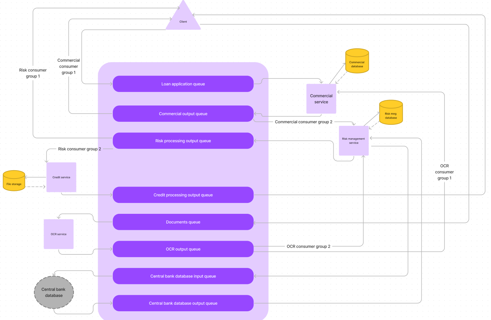
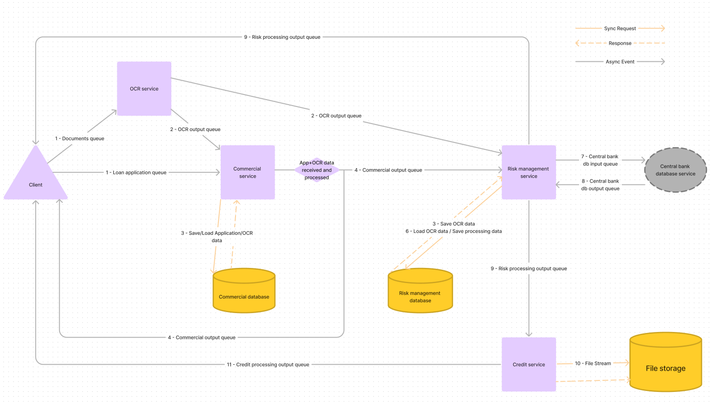

# Lab4 - Towards more reactive microservices

## Requirements

The INSATx team has been asked to build a loan management module of an existing banking application in order to automate the following steps of a loan process:
The client fills in the application form and uploads the list of required documents.
The loan application is first processed by the commercial service, whose task is to check the eligibility of the borrower and the repayment terms and period, based on the borrower’s income and financial situation. An initial scoring is established to assess the eligibility of the client to get the loan.
Once done, the client application is then processed by the risk management service in order to make sure that the suggested debt ratio is sufficient enough to maintain a healthy bank account balance for the borrower and that the loan can still be repaid in full as scheduled. This service also has access to the central bank database in order to assess if there are other outstanding commitments with other banks that have not been paid. The output of this service is a final score which dictates if the borrower’s request should be approved or not.
The client is then notified whether his application for a loan has been approved (in principle) or not. Next, the final step will be established by the credit service that elaborates the credit agreement to be signed and the amortization table. Both documents can be later viewed/downloaded by the client.
Note that the commercial service and the risk management one should use some OCR capabilities in order to automate the extraction and processing of the needed information within the uploaded documents.

## Architecture





## Implementation

The system was implemented as a set of node.js microservices that communicate using Kafka. We opted for Kafka and Node.js for this implementation primarily for their ability to expedite development and simplify implementation. Kafka's distributed messaging system provides robust support for building reactive microservices architectures. Its pub/sub model allows seamless communication between microservices which facilitates decoupling and scalability. Node.js was chosen for its agility and ease of use, prioritizing development speed over raw performance. Its lightweight nature and non-blocking I/O model facilitate rapid prototyping and iteration, enabling quick development cycles.

## Running

The system can be started using docker compose.

```bash
docker-compose up
```
